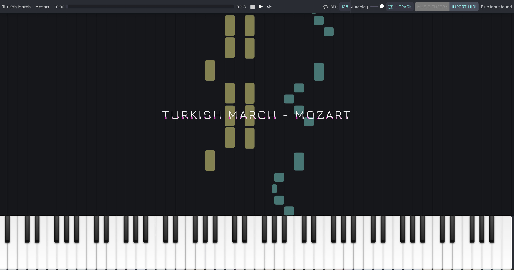

# Vitzik

Vitzik is a set of tools to help learning the piano. It uses the [Web MIDI API](https://developer.mozilla.org/en-US/docs/Web/API/Web_MIDI_API) to detect electronic instruments connected to your laptop via USB. You can import any midi song you would like to learn. The visualizer renders a visualization that shows you which keys to hit. It also detects the input from your instrument and can be set to wait for you to play the right keys before moving forward in the song.

[Demo](https://sinamaltess.github.io/vitzik/)



## Project structure

The application is made of several packages working together in this monorepo.

- `vitzik-ui` : a library that provides _very_ simple UI components. This library is more of an experiment to build a mini bootstrap-like package.
- `vitizik-app` : the main package where the application lives. It contains the visualizer and all the fuss.

At this stage the application is still experimental therefore there is no versioning of the packages yet.

## Local development

The monorepo uses [Lerna](https://lerna.js.org/) to run commands across multiple packages at once.

Install dependencies:

```sh
npm install
```

Start application:

```sh
npm start
```

Run tests:

```sh
npm run test
```

Build the packages:

```sh
npm run build
```

Note : tests and prettier are automatically run when committing. If a test fails the commit will be aborted.

## Useful Links

- [Project conventions](docs/project_conventions.md)
- [SoundFont Technical Specification](https://freepats.zenvoid.org/sf2/sfspec24.pdf)
